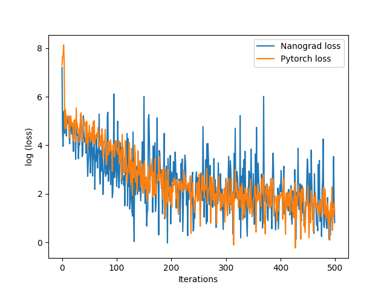
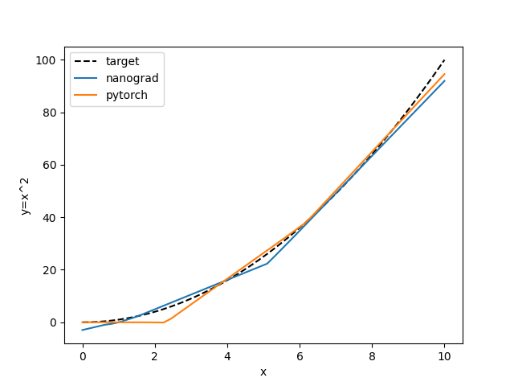

# nanograd

Own version of [micrograd](https://github.com/karpathy/micrograd)

See `benchmark.py` for a comparison with a torch model of same size (layer size 1,10,10,1) using 
`SGD` optimizer and `MSE` as loss function. In the example I try to approximate $y=x^2$.

Loss            |  Predictions
:--------------:|:-----------------------:
   |  

```cmd
Nanograd training: 50.84s, Torch training: 1.85s
```
It is considerably slower than pytorch since the autograd is implemented on a scalar level not 
tensor.

## Testing
```cmd
pytest nanograd
```